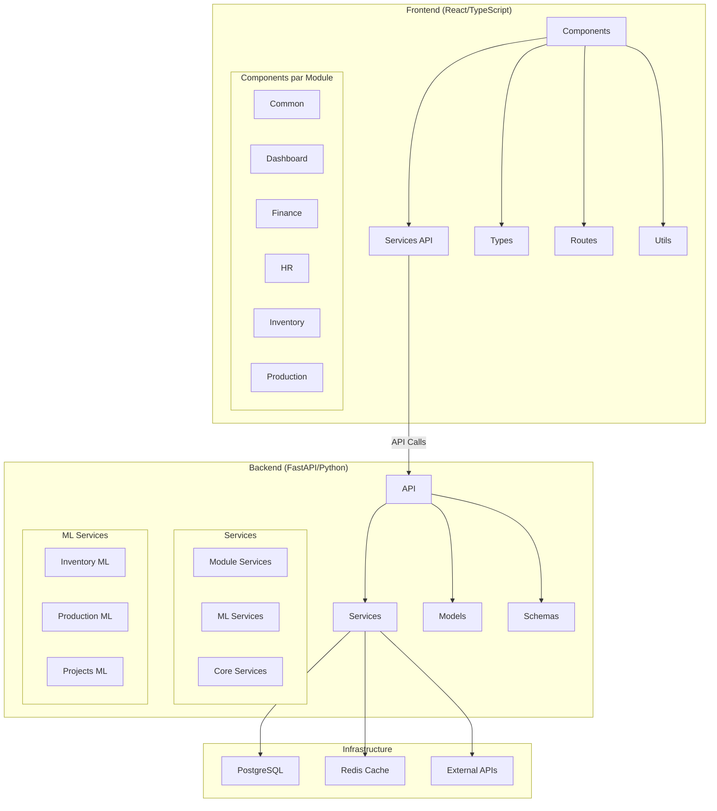
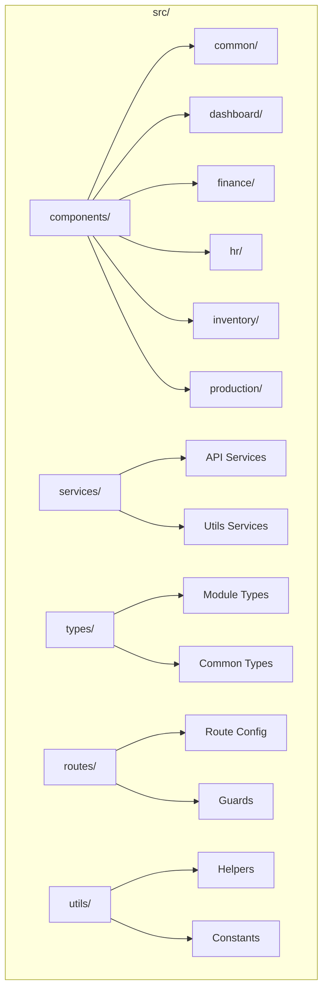
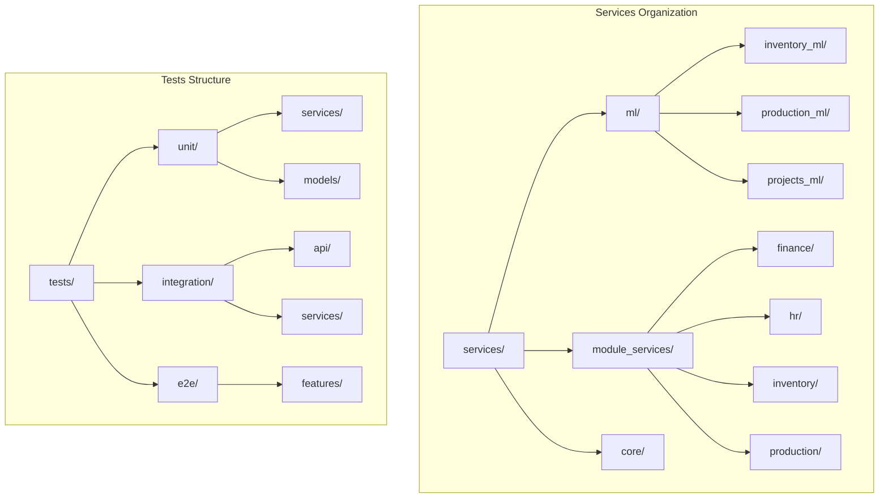
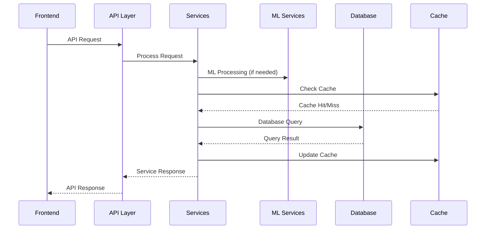

# Nouvelle Architecture FOFAL ERP

## Vue d'Ensemble

## Structure Détaillée

### Frontend

### Backend

## Flux de Données

## Notes Techniques

### 1. Standards de Nommage
- Components: PascalCase (InventoryList, ProductionStats)
- Services: camelCase (inventoryService, productionService)
- Types: PascalCase avec suffixe Type/Interface (InventoryItem, ProductionStats)
- API Endpoints: kebab-case (/api/v1/inventory-items)

### 2. Organisation des Tests
- Unit: Tests isolés des services et modèles
- Integration: Tests des interactions entre composants
- E2E: Tests des flux complets utilisateur

### 3. ML Services
- Modèles standardisés
- Pipeline de données unifié
- Métriques communes
- Cache des prédictions

### 4. Sécurité
- Authentication JWT
- RBAC pour autorisations
- Validation des données
- Rate limiting
- Audit logs
