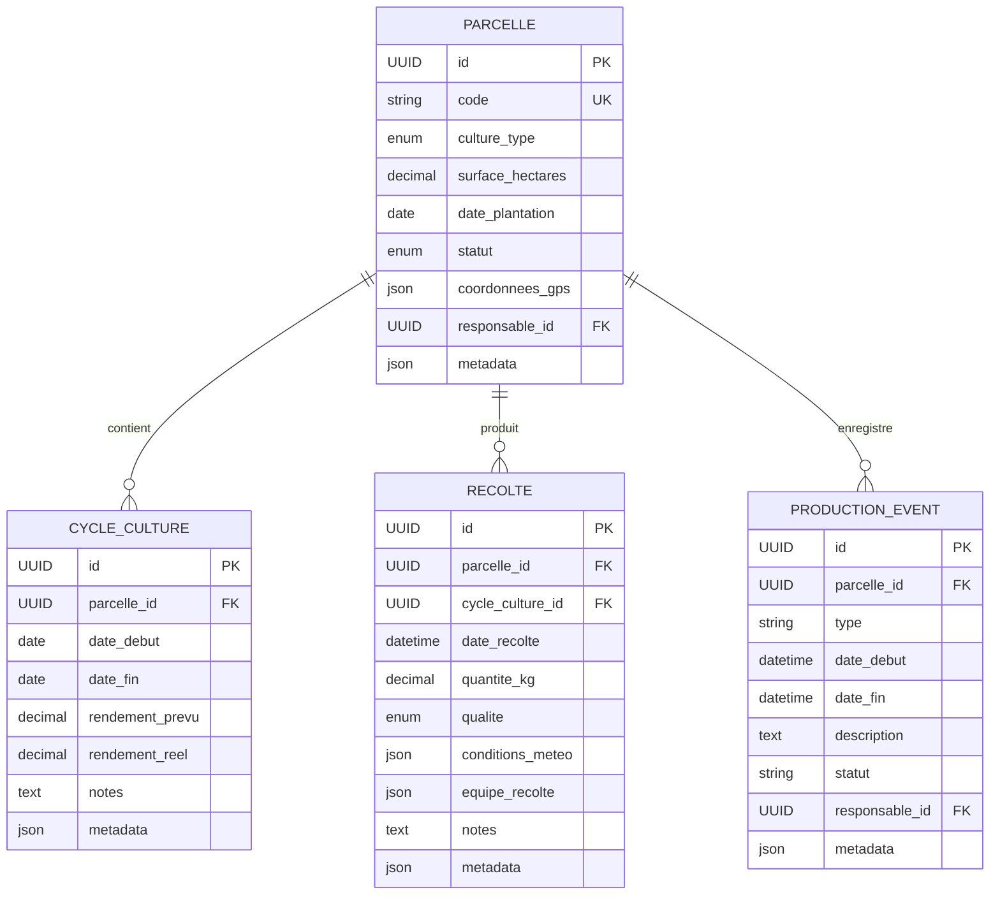
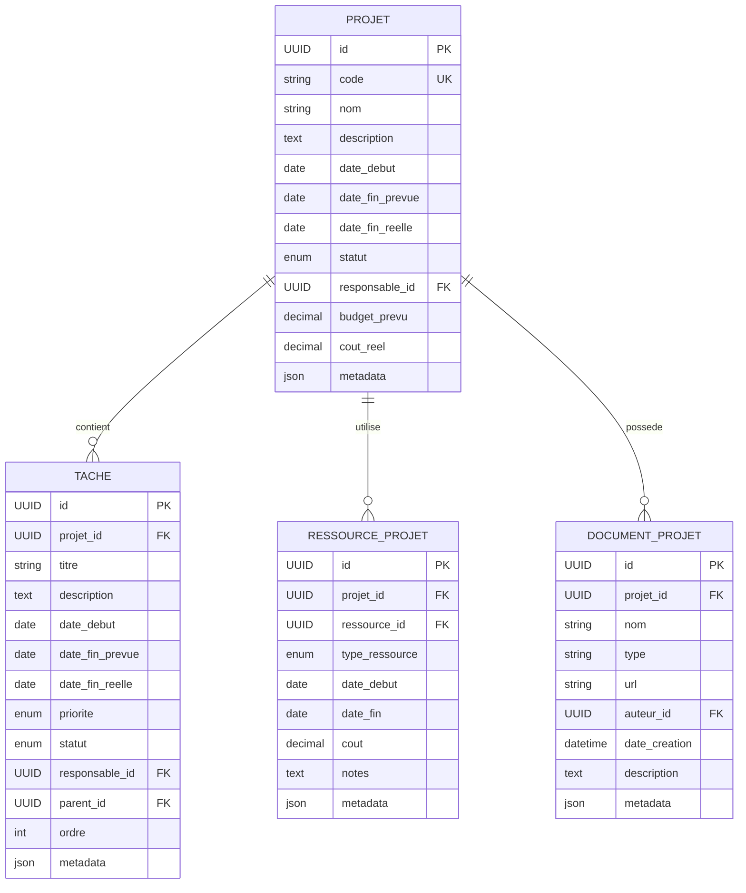
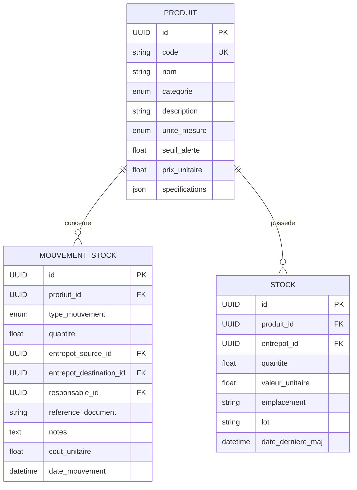
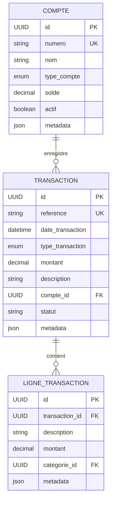
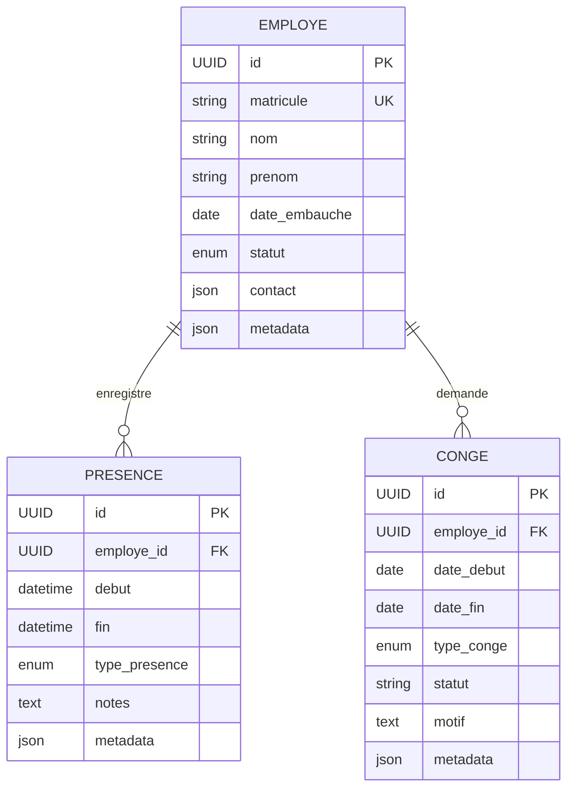
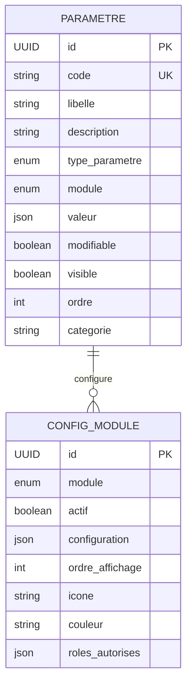

# Schéma de Base de Données FOFAL ERP

## Vue d'Ensemble
Ce document présente la structure complète de la base de données de l'ERP FOFAL, incluant les relations entre les tables et les contraintes principales.

## Modules et Tables

### 1. Module Production

### 2. Module Gestion de Projets

### 3. Module Inventaire

### 4. Module Finance

### 5. Module RH

### 6. Paramétrage

## Notes Techniques

### Conventions
1. Clés Primaires
   - Utilisation d'UUID pour toutes les tables
   - Préfixe 'id_' pour les clés étrangères

2. Types de Données
   - Decimal pour les montants et quantités
   - JSON pour les données flexibles
   - Enum pour les valeurs prédéfinies

### Contraintes
1. Intégrité Référentielle
   - Suppression en cascade désactivée
   - Mise à jour en cascade activée

2. Indexation
   - Index sur les clés étrangères
   - Index sur les colonnes de recherche fréquente

### Optimisation
1. Performance
   - Partitionnement par date pour les grandes tables
   - Indexation adaptée aux requêtes fréquentes

2. Maintenance
   - Backup quotidien
   - Vacuum régulier
   - Monitoring des performances
