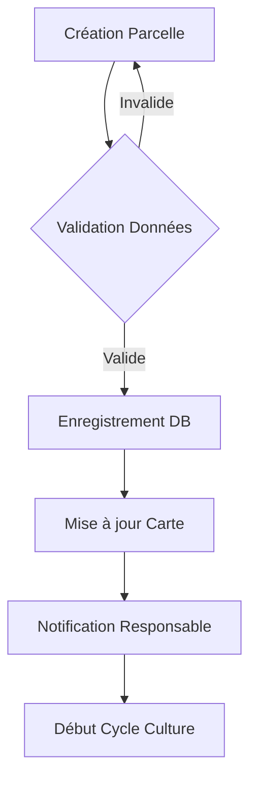
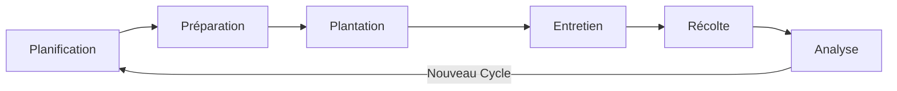
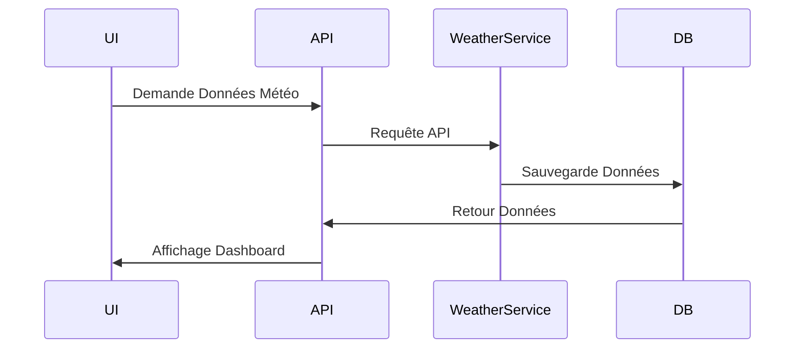
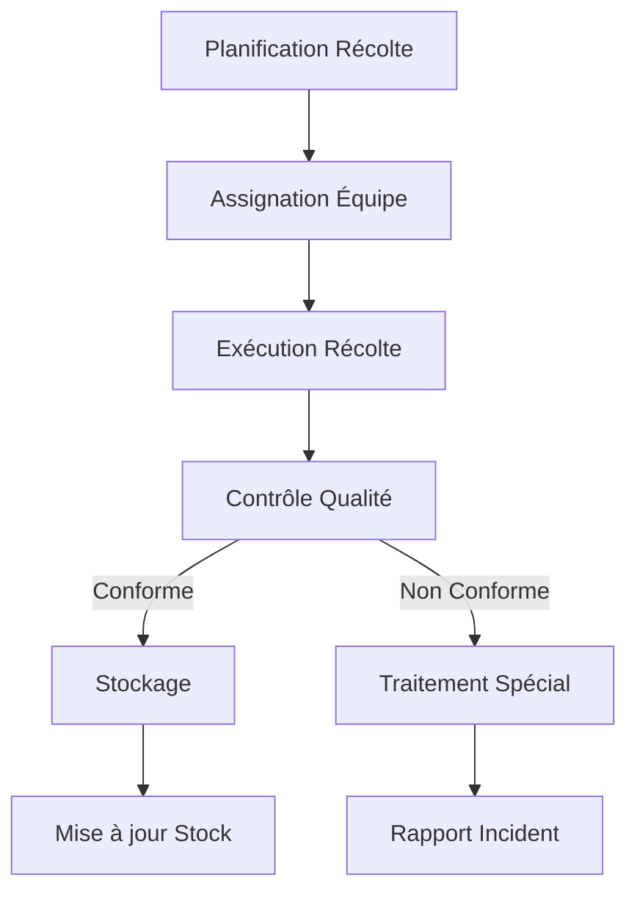
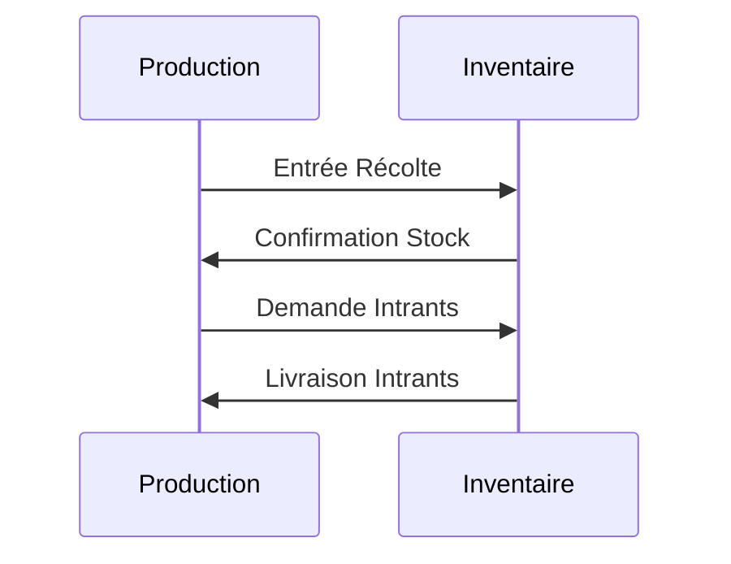
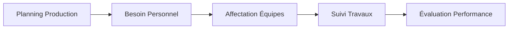
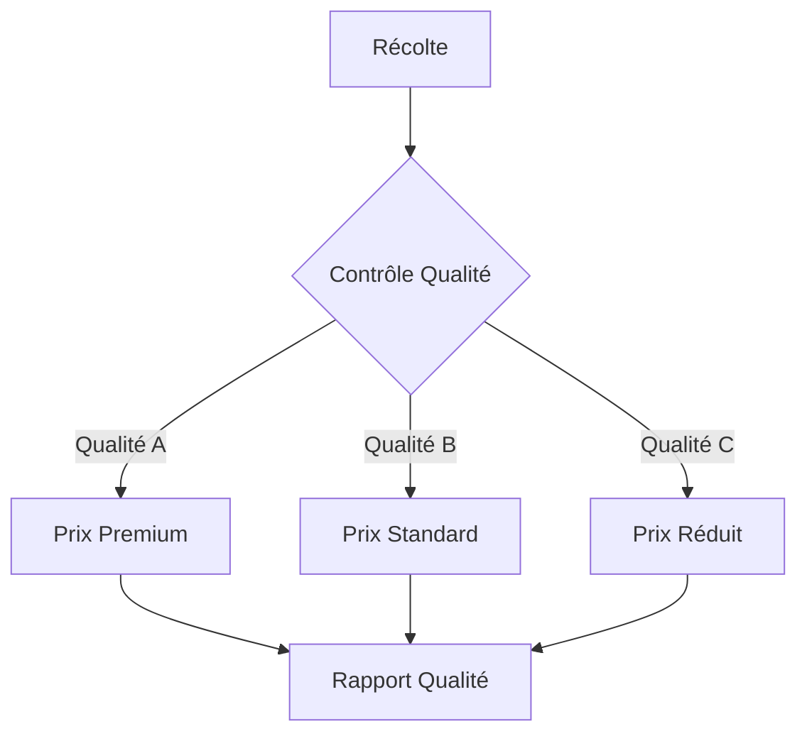
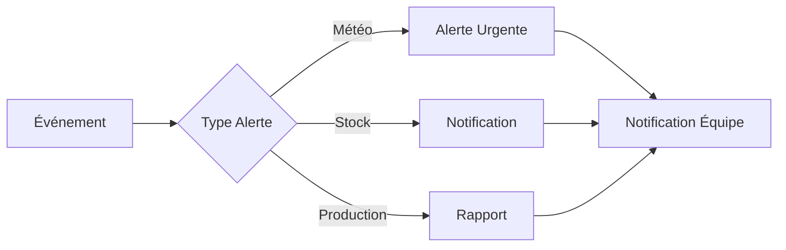
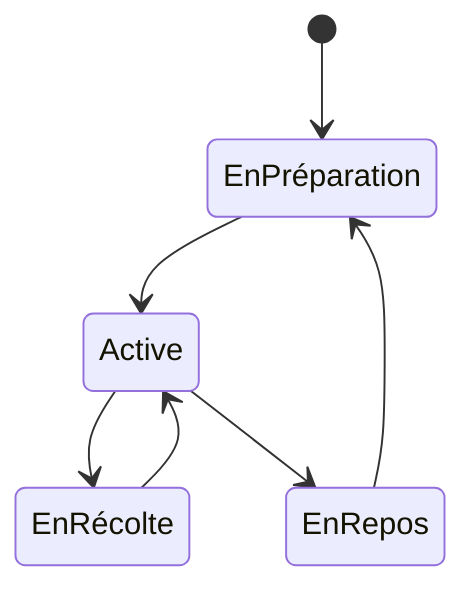
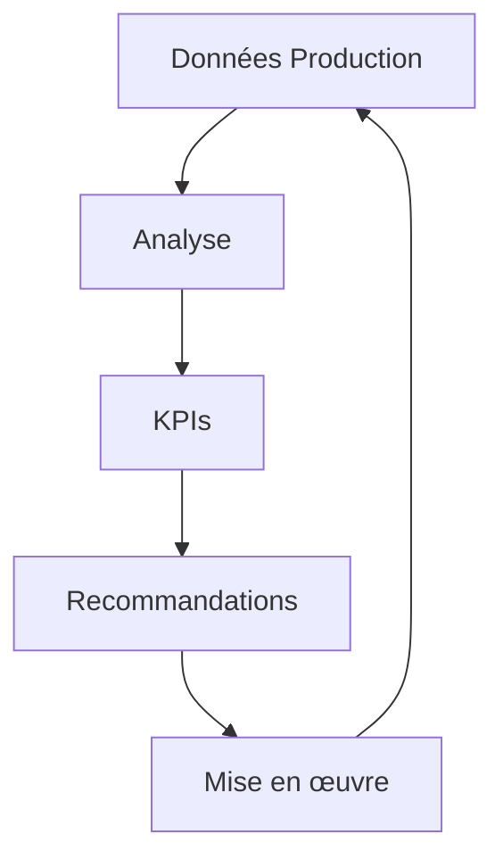

# Diagramme de Flux - Module Production

## Vue d'Ensemble
Ce document décrit les flux de données et les processus du module de production de l'ERP FOFAL, spécialisé dans la gestion des cultures de palmier à huile et de papayes.

## Flux Principaux

### 1. Gestion des Parcelles

### 2. Cycle de Culture

### 3. Monitoring Météo

### 4. Processus de Récolte

## Interactions avec Autres Modules

### Production ↔ Inventaire

### Production ↔ RH

## Points de Contrôle

### Qualité Production

### Alertes et Notifications

## États des Parcelles

## Processus d'Optimisation

### Analyse Performance

## Notes Techniques

1. Intégration API
- Données météo en temps réel
- Géolocalisation des parcelles
- Synchronisation mobile

2. Validation Données
- Vérification coordonnées GPS
- Validation surfaces
- Contrôle dates

3. Performance
- Cache données météo
- Optimisation requêtes
- Pagination résultats

4. Sécurité
- Authentification requise
- Logs actions
- Sauvegarde données
