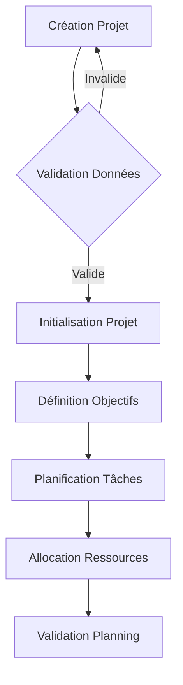
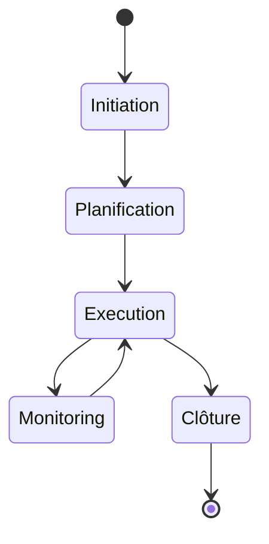
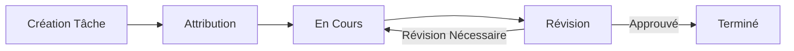
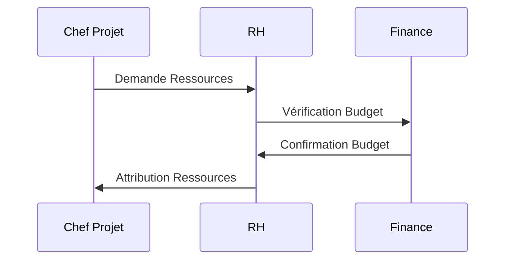
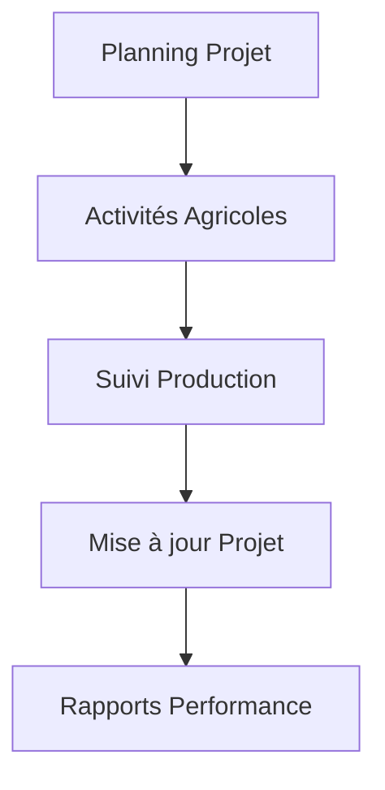
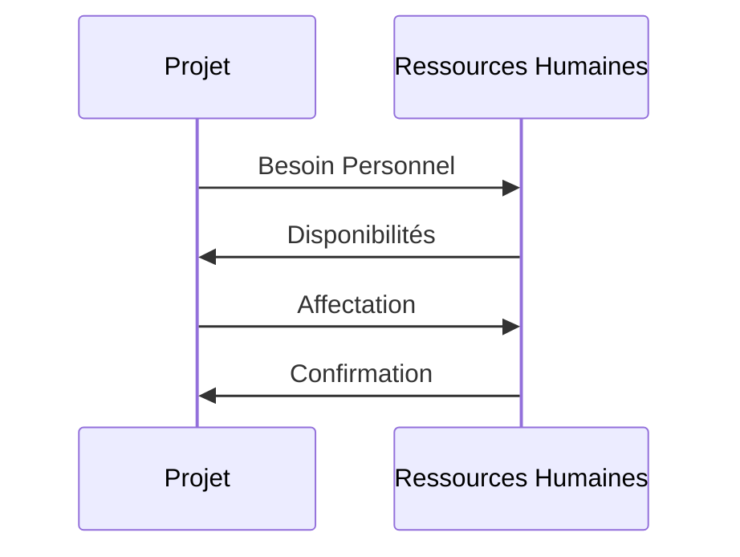
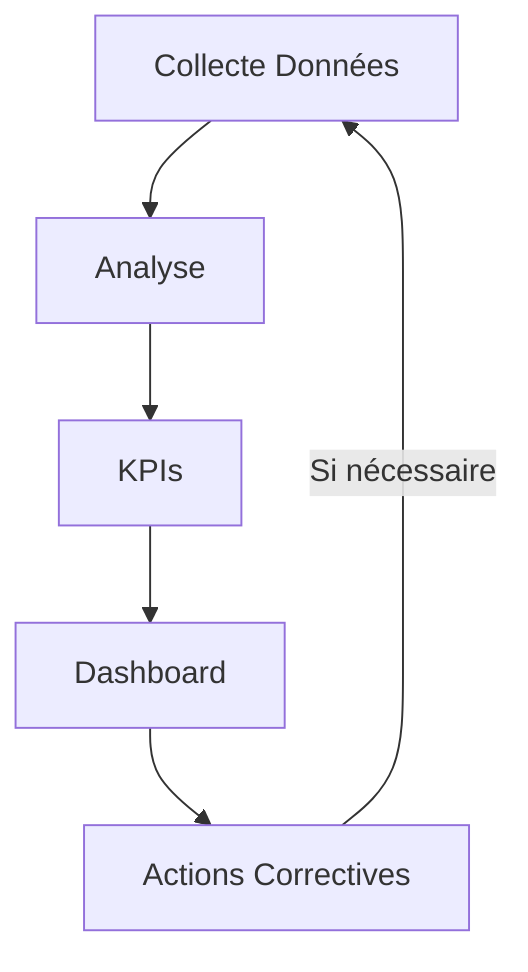
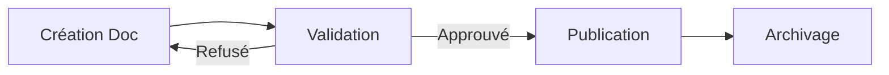
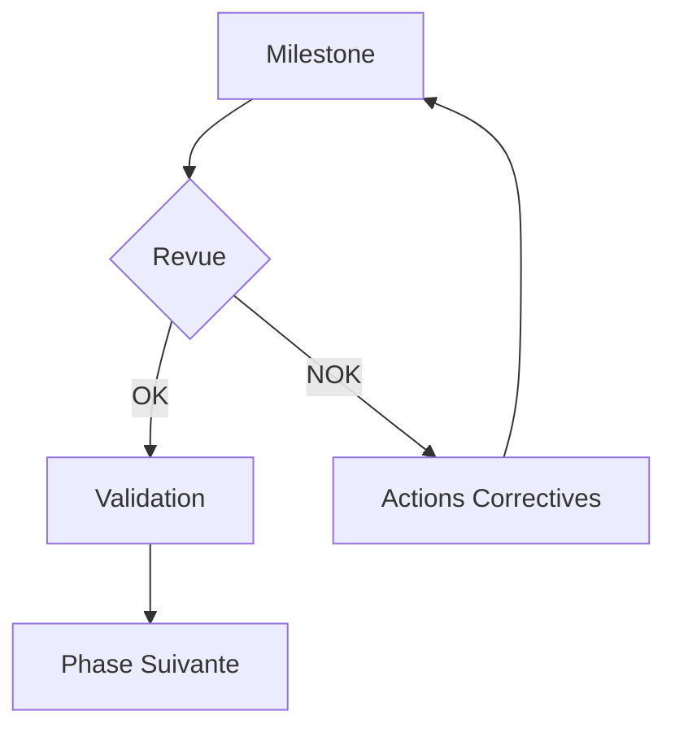
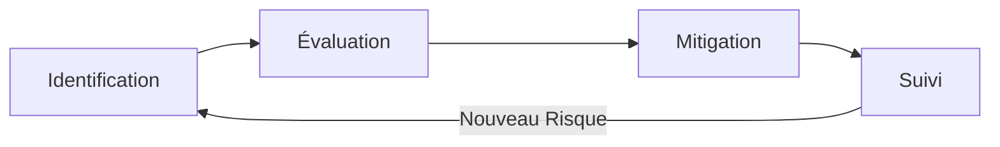

# Diagramme de Flux - Module Gestion de Projets

## Vue d'Ensemble
Ce document décrit les flux de données et les processus du module de gestion de projets de l'ERP FOFAL.

## Flux Principaux

### 1. Création et Planification de Projet

### 2. Cycle de Vie du Projet

### 3. Gestion des Tâches

### 4. Suivi des Ressources

## Interactions avec Autres Modules

### Projets ↔ Production

### Projets ↔ RH

## Processus de Reporting

### Suivi d'Avancement

### Gestion Documentaire

## Points de Contrôle

### Validation des Étapes

### Gestion des Risques

## Notes Techniques

1. Intégration
- Synchronisation avec le calendrier de production
- Liaison avec la gestion RH
- Interface avec le module financier

2. Automatisations
- Notifications automatiques
- Rappels d'échéances
- Génération de rapports
- Mise à jour des tableaux de bord

3. Sécurité
- Contrôle d'accès par rôle
- Traçabilité des actions
- Protection des données sensibles

4. Performance
- Optimisation des requêtes
- Cache des données fréquentes
- Pagination des résultats
