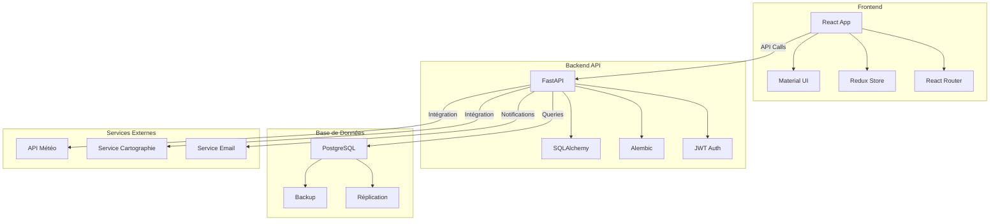
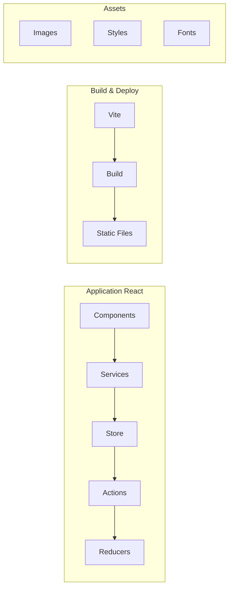
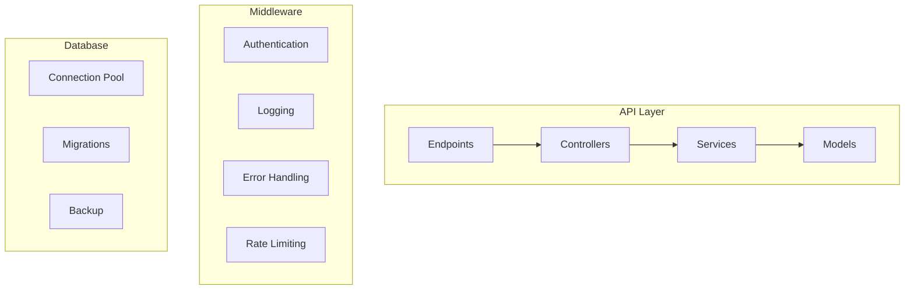
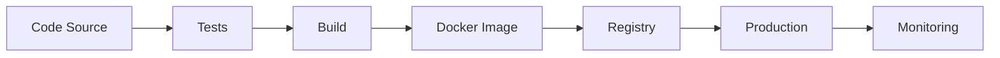
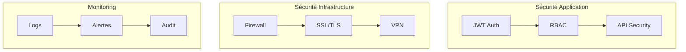
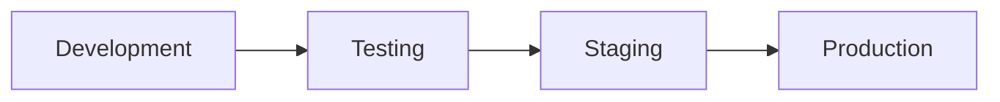
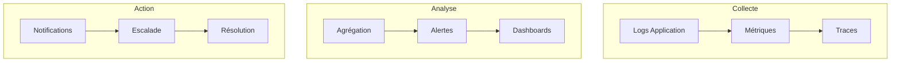

# Architecture d'Infrastructure FOFAL ERP

## Vue d'Ensemble
Ce document décrit l'architecture technique et l'infrastructure du système ERP FOFAL.

## Architecture Globale

## Composants Techniques

### 1. Frontend (Client)

### 2. Backend (Serveur)

## Flux de Déploiement

## Sécurité

## Environnements

## Monitoring et Logging

## Spécifications Techniques

### 1. Exigences Serveur
- CPU: 4+ cores
- RAM: 16GB minimum
- Stockage: SSD 500GB+
- OS: Linux (Ubuntu LTS)

### 2. Mise à l'échelle
- Load Balancer
- Réplication Base de données
- Cache distribué
- CDN pour assets statiques

### 3. Backup et Récupération
- Backup quotidien base de données
- Rétention 30 jours
- Test de restauration mensuel
- Réplication en temps réel

### 4. Monitoring
- Uptime: 99.9%
- Latence API: <100ms
- Utilisation CPU/RAM
- Erreurs et exceptions

## Notes de Déploiement

### 1. Prérequis
- Docker et Docker Compose
- Nginx
- PostgreSQL
- Redis
- Python 3.9+
- Node.js 16+

### 2. Configuration
- Variables d'environnement
- Fichiers de configuration
- Certificats SSL
- Clés API

### 3. Maintenance
- Mises à jour de sécurité
- Optimisation base de données
- Nettoyage des logs
- Rotation des certificats
