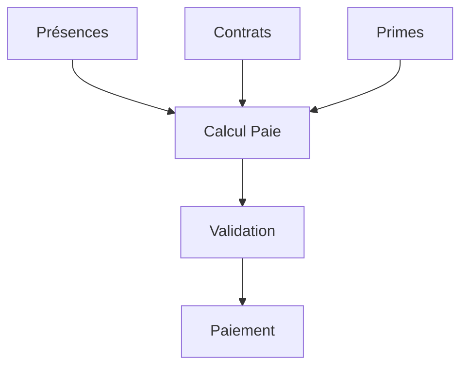

# Guide d'Intégration - Module de Paie

## Intégrations avec les Autres Modules

### 1. Ressources Humaines

#### Contrats
- Récupération des informations contractuelles pour le calcul des salaires
- Synchronisation avec les modifications de contrat
- Gestion des périodes d'essai et des fins de contrat

#### Présences
- Import des heures travaillées
- Calcul automatique des heures supplémentaires
- Prise en compte des congés et absences

#### Compétences
- Intégration des primes liées aux compétences
- Gestion des augmentations basées sur les évaluations

### 2. Production

#### Données IoT
- Intégration des données de présence des capteurs
- Validation automatique des heures de travail
- Alertes en cas d'incohérence

#### Météo
- Prise en compte des conditions météorologiques pour les primes
- Calcul des indemnités intempéries
- Ajustement des heures travaillées

### 3. Finance/Comptabilité

#### Comptabilité
- Export automatique des écritures comptables
- Génération des journaux de paie
- Suivi des provisions

#### Trésorerie
- Planification des paiements
- Gestion des acomptes
- Suivi du budget RH

### 4. Inventaire

#### Équipements
- Gestion des primes d'équipement
- Suivi des dotations
- Déductions pour le matériel

## Points d'Attention

### 1. Synchronisation des Données

- Les données de présence doivent être validées avant la génération des fiches
- Les modifications de contrat sont prises en compte au prorata
- Les primes exceptionnelles nécessitent une validation RH

### 2. Sécurité

- Accès restreint aux données sensibles
- Traçabilité des modifications
- Validation multi-niveau pour les paiements

### 3. Performance

- Optimisation des calculs batch
- Cache des données fréquemment utilisées
- Exécution asynchrone des tâches lourdes

## Processus d'Intégration

### 1. Collecte des Données

### 2. Validation

1. Vérification automatique
   - Cohérence des heures
   - Respect des plafonds
   - Validation des taux

2. Validation manuelle
   - Contrôle RH
   - Validation manager
   - Approbation direction

### 3. Traitement

1. Calculs
   - Salaire de base
   - Primes et indemnités
   - Charges sociales

2. Intégration
   - Export comptable
   - Mise à jour trésorerie
   - Archivage documents

## Maintenance

### 1. Mises à Jour

- Synchronisation avec les évolutions réglementaires
- Mise à jour des taux et plafonds
- Adaptation aux nouveaux besoins

### 2. Monitoring

- Surveillance des performances
- Détection des anomalies
- Alertes automatiques

### 3. Support

- Documentation technique
- Procédures de dépannage
- Contact support dédié

## Tests

### 1. Tests Unitaires

- Calculs de paie
- Règles métier
- Validations

### 2. Tests d'Intégration

- Flux de données
- Synchronisation
- Export comptable

### 3. Tests E2E

- Processus complet
- Scénarios utilisateur
- Cas limites

## Évolutions Futures

### 1. Prévues

- Intégration ML pour prévisions
- Optimisation des calculs
- Amélioration interface

### 2. Possibles

- Module formation
- Gestion des talents
- Analytics RH avancés
