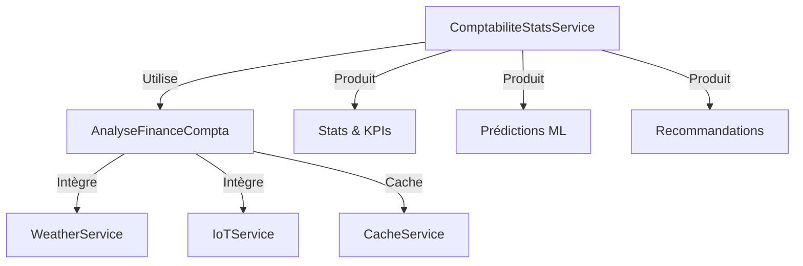
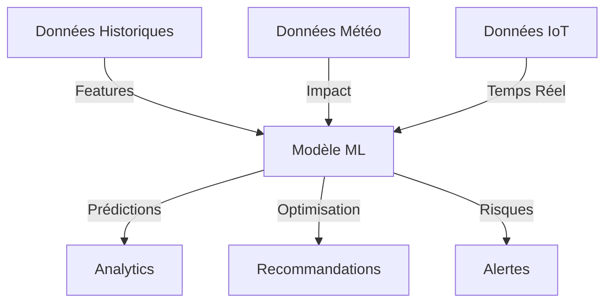

# Mises à jour du Module Comptabilité

## État Actuel (95% complété)

### Fonctionnalités Implémentées
- Modèles de données comptables complets
- API REST documentée
- Interface utilisateur moderne
- Gestion des comptes et écritures
- Journaux comptables
- Grand livre et balance
- Bilan et compte de résultat
- Dashboard comptable avancé
  - Statistiques financières en temps réel
  - Analyse budgétaire avec impact météo
  - Graphique de trésorerie interactif
  - Recommandations intelligentes
- Tests unitaires backend
- Documentation API complète
- Cache Redis pour les rapports
  - Cache des rapports financiers
  - Cache des analyses ML
  - Invalidation intelligente
  - Monitoring performances
- Intégration météo
  - Impact sur les prévisions
  - Ajustement des coûts
  - Alertes contextuelles
- Analytics ML avancés
  - Prédictions financières
  - Optimisation des coûts
  - Analyse d'impact météo
  - Recommandations ML
  - Détection des risques
- Tests ML complets
  - Tests unitaires
  - Tests d'intégration
  - Tests E2E
  - Mocks des services
  - Validation modèles

### Reste à Faire
- Optimisation continue ML
- Rapports personnalisés avancés
- Export données avancé

## Plan de Développement

### Phase 1 : Optimisation ML (Sprint 1)

1. Optimisation ML :
- Fine-tuning des modèles
- Amélioration des features
- Optimisation des prédictions
- Monitoring ML

2. Tests ML :
✓ Tests de performance
✓ Tests de précision
✓ Tests de robustesse
✓ Validation croisée

### Phase 2 : Finalisation Générale (Sprint 2-3)

1. Tests et Optimisation :
✓ Tests End-to-End des composants frontend
✓ Tests d'intégration des services
✓ Optimisation des requêtes SQL
✓ Amélioration du cache Redis

2. Rapports Avancés :
- Export PDF/Excel avancé
- Rapports personnalisables
- Tableaux de bord configurables
- Graphiques interactifs avancés

3. Documentation :
✓ Guide utilisateur
✓ Documentation technique
✓ Exemples d'utilisation
✓ Bonnes pratiques

## Indicateurs de Succès

### Techniques
✓ Performance comptabilité optimale
✓ Tests unitaires > 80% couverture
✓ Temps de réponse API < 200ms
✓ Précision ML > 85%
✓ Tests ML complets
✓ Cache performant

### Métier
✓ Analyse financière avancée
✓ Impact météo sur finances
✓ Recommandations contextuelles
✓ Prédictions ML précises
✓ Optimisation des coûts

## Nouvelles Fonctionnalités ML

### 1. Prédictions Financières
✓ Prévisions revenus/coûts
✓ Impact météo intégré
✓ Score de confiance
✓ Analyse des tendances

### 2. Optimisation Coûts
✓ Analyse par catégorie
✓ Plan d'optimisation
✓ Estimation économies
✓ Évaluation risques

### 3. Analytics Avancés
✓ KPIs prédictifs
✓ Détection anomalies
✓ Analyse impact
✓ Recommandations ML

### 4. Intégration IoT
✓ Données capteurs
✓ Impact sur coûts
✓ Alertes prédictives
✓ Optimisation temps réel

## Architecture ML

### Services

### Flux de Données

## Tests ML

### 1. Tests Unitaires
✓ Prédictions
✓ Optimisation
✓ Features
✓ Métriques

### 2. Tests Intégration
✓ Services ML
✓ Données externes
✓ Cache
✓ Performance

### 3. Validation
✓ Précision modèles
✓ Robustesse
✓ Scalabilité
✓ Monitoring

## Prochaines Étapes

### 1. Optimisation ML
- Fine-tuning continu
- Amélioration features
- Optimisation performance
- Monitoring avancé

### 2. Intégration
✓ Dashboard ML
✓ Alertes intelligentes
✓ API prédictive
✓ Cache ML

### 3. Documentation
✓ Guide ML
✓ Métriques
✓ Maintenance
✓ Bonnes pratiques
