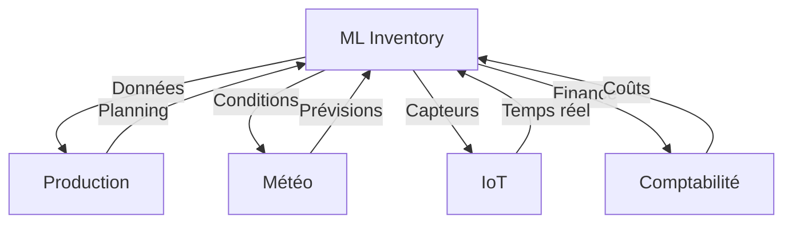

# Intégrations ML - Inventaire

## Vue d'Ensemble

### Architecture Intégrations


## Intégrations Principales

### 1. Production
```python
class ProductionIntegration:
    """
    Intégration avec module production
    
    Objectifs:
    - Synchronisation planning production
    - Anticipation besoins stockage
    - Optimisation flux matières
    """
    
    def process_production_data(
        self,
        production_plan: Dict[str, Any],
        current_stock: Dict[str, float]
    ) -> Dict[str, Any]:
        """
        Traite données production pour ML
        
        Args:
            production_plan: Planning production
            current_stock: Niveaux stocks actuels
            
        Returns:
            Dict contenant:
            - storage_requirements: Besoins stockage
            - timing: Planning optimal
            - constraints: Contraintes identifiées
        """
        
    def optimize_production_storage(
        self,
        production_forecast: Dict[str, Any],
        storage_capacity: Dict[str, float],
        constraints: Dict[str, Any]
    ) -> Dict[str, Any]:
        """
        Optimise coordination production-stockage
        
        Returns:
            Dict recommandations optimisation
        """
```

### 2. Météo
```python
class WeatherIntegration:
    """
    Intégration données météorologiques
    
    Objectifs:
    - Impact conditions stockage
    - Prévision risques
    - Adaptation stockage
    """
    
    def process_weather_data(
        self,
        forecast: Dict[str, Any],
        storage_conditions: Dict[str, float]
    ) -> Dict[str, Any]:
        """
        Analyse impact météo sur stockage
        
        Args:
            forecast: Prévisions météo
            storage_conditions: Conditions actuelles
            
        Returns:
            Dict contenant:
            - risk_assessment: Évaluation risques
            - recommendations: Actions suggérées
            - adjustments: Ajustements requis
        """
        
    def predict_storage_conditions(
        self,
        weather_forecast: Dict[str, Any],
        storage_config: Dict[str, Any]
    ) -> Dict[str, Any]:
        """
        Prédit conditions stockage futures
        
        Returns:
            Dict prévisions conditions
        """
```

### 3. IoT
```python
class IoTIntegration:
    """
    Intégration capteurs IoT
    
    Objectifs:
    - Monitoring temps réel
    - Détection anomalies
    - Contrôle qualité
    """
    
    def process_sensor_data(
        self,
        sensor_data: Dict[str, Any],
        thresholds: Dict[str, float]
    ) -> Dict[str, Any]:
        """
        Traite données capteurs
        
        Args:
            sensor_data: Données capteurs
            thresholds: Seuils alertes
            
        Returns:
            Dict contenant:
            - current_state: État actuel
            - anomalies: Anomalies détectées
            - alerts: Alertes générées
        """
        
    def optimize_monitoring(
        self,
        sensor_config: Dict[str, Any],
        historical_data: Dict[str, Any]
    ) -> Dict[str, Any]:
        """
        Optimise configuration monitoring
        
        Returns:
            Dict configuration optimisée
        """
```

### 4. Finance
```python
class FinanceIntegration:
    """
    Intégration données financières
    
    Objectifs:
    - Optimisation coûts stockage
    - Valorisation stocks
    - Analyse rentabilité
    """
    
    def analyze_storage_costs(
        self,
        storage_data: Dict[str, Any],
        financial_params: Dict[str, float]
    ) -> Dict[str, Any]:
        """
        Analyse coûts stockage
        
        Args:
            storage_data: Données stockage
            financial_params: Paramètres financiers
            
        Returns:
            Dict contenant:
            - cost_analysis: Analyse coûts
            - optimization: Pistes optimisation
            - projections: Projections financières
        """
        
    def optimize_inventory_value(
        self,
        inventory_data: Dict[str, Any],
        market_conditions: Dict[str, Any]
    ) -> Dict[str, Any]:
        """
        Optimise valeur stocks
        
        Returns:
            Dict recommandations optimisation
        """
```

## Pipeline Intégration

### Orchestration
```python
class IntegrationPipeline:
    """Pipeline intégration données"""
    
    def __init__(self):
        self.production = ProductionIntegration()
        self.weather = WeatherIntegration()
        self.iot = IoTIntegration()
        self.finance = FinanceIntegration()
        
    def process_all(
        self,
        data: Dict[str, Any],
        config: Dict[str, Any]
    ) -> Dict[str, Any]:
        """
        Traitement complet données
        
        Returns:
            Dict résultats intégrés
        """
```

### Synchronisation
```python
class DataSynchronizer:
    """Synchronisation données inter-modules"""
    
    def sync_data(
        self,
        source_data: Dict[str, Any],
        target_module: str
    ) -> bool:
        """
        Synchronise données entre modules
        
        Returns:
            Statut synchronisation
        """
```

## Monitoring Intégrations

### Performance
```python
def monitor_integration_performance(
    pipeline: IntegrationPipeline,
    timeframe: str = '24h'
) -> Dict[str, float]:
    """
    Monitore performance intégrations
    
    Returns:
        Dict métriques performance
    """
```

### Santé
```python
def check_integration_health(
    pipeline: IntegrationPipeline
) -> Dict[str, str]:
    """
    Vérifie santé intégrations
    
    Returns:
        Dict statuts santé
    """
```

## Maintenance

### 1. Validation
```python
def validate_integrations(
    pipeline: IntegrationPipeline,
    test_data: Dict[str, Any]
) -> Dict[str, bool]:
    """
    Valide intégrité intégrations
    
    Returns:
        Dict résultats validation
    """
```

### 2. Réparation
```python
def repair_integration(
    module: str,
    error_data: Dict[str, Any]
) -> bool:
    """
    Répare problèmes intégration
    
    Returns:
        Succès réparation
    """
```

## Tests

### 1. Tests Unitaires
```python
def test_production_integration():
    """Test intégration production"""
    integration = ProductionIntegration()
    result = integration.process_production_data(test_data)
    assert validate_production_result(result)

def test_weather_integration():
    """Test intégration météo"""
    integration = WeatherIntegration()
    result = integration.process_weather_data(test_data)
    assert validate_weather_result(result)
```

### 2. Tests Intégration
```python
def test_full_pipeline():
    """Test pipeline complet"""
    pipeline = IntegrationPipeline()
    result = pipeline.process_all(test_data)
    assert validate_pipeline_result(result)
```

## Configuration

### 1. Production
```python
PRODUCTION_CONFIG = {
    'sync_interval': 300,  # 5 minutes
    'batch_size': 100,
    'priority_levels': {
        'high': 0.8,
        'medium': 0.5,
        'low': 0.2
    }
}
```

### 2. Météo
```python
WEATHER_CONFIG = {
    'update_interval': 1800,  # 30 minutes
    'forecast_window': 168,   # 7 jours
    'critical_conditions': {
        'temperature_max': 30,
        'humidity_max': 80
    }
}
```

### 3. IoT
```python
IOT_CONFIG = {
    'polling_interval': 60,   # 1 minute
    'batch_size': 50,
    'retry_attempts': 3,
    'timeout': 5
}
```

### 4. Finance
```python
FINANCE_CONFIG = {
    'update_interval': 3600,  # 1 heure
    'cost_factors': {
        'storage': 0.4,
        'handling': 0.3,
        'maintenance': 0.3
    }
}
