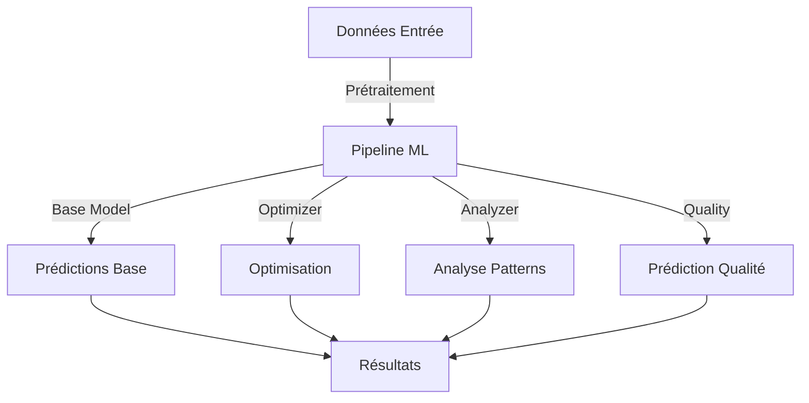

# Modèles ML - Inventaire

## Architecture Globale

### Vue d'Ensemble


## Modèles Principaux

### 1. BaseMLModel
```python
class BaseMLModel:
    """
    Modèle ML fondamental pour inventaire agricole
    
    Features:
    - Données météo (température, humidité, etc.)
    - Données production (cycles, volumes, etc.)
    - Données historiques (mouvements, qualité)
    - Données IoT (capteurs temps réel)
    """
    
    def __init__(
        self,
        config: Dict[str, Any] = DEFAULT_CONFIG,
        features: List[str] = None,
        target: str = 'optimal_stock_level'
    ):
        self.config = self._validate_config(config)
        self.features = features or DEFAULT_FEATURES
        self.target = target
        self.model = self._initialize_model()
        self.scaler = self._initialize_scaler()
        self.validator = self._initialize_validator()
    
    def train(
        self,
        data: pd.DataFrame,
        validation_split: float = 0.2
    ) -> Dict[str, float]:
        """
        Entraîne le modèle avec validation
        
        Args:
            data: Données d'entraînement
            validation_split: Ratio validation
            
        Returns:
            Dict contenant métriques:
            - accuracy: Précision globale
            - mae: Erreur absolue moyenne
            - rmse: Erreur quadratique moyenne
            - r2: Score R2
        """
        
    def predict(
        self,
        features: np.ndarray,
        return_confidence: bool = True
    ) -> Union[np.ndarray, Tuple[np.ndarray, np.ndarray]]:
        """
        Effectue prédictions avec confiance optionnelle
        
        Args:
            features: Features d'entrée
            return_confidence: Retourner score confiance
            
        Returns:
            Prédictions et scores confiance optionnels
        """
        
    def evaluate(
        self,
        test_data: pd.DataFrame
    ) -> Dict[str, float]:
        """
        Évalue performance modèle
        
        Args:
            test_data: Données test
            
        Returns:
            Dict métriques performance
        """
```

### 2. StockOptimizer
```python
class StockOptimizer:
    """
    Optimisation des niveaux de stock avec contraintes
    
    Algorithmes:
    - Optimisation linéaire
    - Algorithmes génétiques
    - Gradient boosting
    """
    
    def __init__(
        self,
        base_model: BaseMLModel,
        constraints: Dict[str, Any] = None
    ):
        self.base_model = base_model
        self.constraints = constraints or DEFAULT_CONSTRAINTS
        self.optimizer = self._initialize_optimizer()
        
    def optimize(
        self,
        current_stock: Dict[str, float],
        forecast: Dict[str, Any],
        constraints: Dict[str, Any] = None
    ) -> Dict[str, Any]:
        """
        Optimise niveaux stocks
        
        Args:
            current_stock: Niveaux actuels
            forecast: Prévisions (météo, production)
            constraints: Contraintes spécifiques
            
        Returns:
            Dict contenant:
            - optimal_levels: Niveaux optimaux
            - adjustments: Ajustements requis
            - costs: Coûts estimés
            - risks: Risques identifiés
        """
        
    def simulate(
        self,
        scenario: Dict[str, Any],
        iterations: int = 1000
    ) -> Dict[str, Any]:
        """
        Simule scénarios optimisation
        
        Args:
            scenario: Paramètres scénario
            iterations: Nombre itérations
            
        Returns:
            Dict résultats simulation
        """
```

### 3. PatternAnalyzer
```python
class PatternAnalyzer:
    """
    Analyse patterns consommation et stockage
    
    Techniques:
    - Analyse séries temporelles
    - Détection anomalies
    - Clustering
    """
    
    def __init__(
        self,
        config: Dict[str, Any] = None
    ):
        self.config = config or DEFAULT_CONFIG
        self.models = self._initialize_models()
        
    def analyze_seasonality(
        self,
        data: pd.DataFrame,
        product_type: str,
        granularity: str = 'daily'
    ) -> Dict[str, Any]:
        """
        Analyse patterns saisonniers
        
        Args:
            data: Données historiques
            product_type: Type produit
            granularity: Granularité analyse
            
        Returns:
            Dict contenant:
            - seasonal_patterns: Patterns identifiés
            - trends: Tendances détectées
            - anomalies: Points anormaux
            - recommendations: Suggestions
        """
        
    def detect_anomalies(
        self,
        data: pd.DataFrame,
        sensitivity: float = 0.05
    ) -> Dict[str, Any]:
        """
        Détecte anomalies dans patterns
        
        Args:
            data: Données à analyser
            sensitivity: Seuil sensibilité
            
        Returns:
            Dict anomalies détectées
        """
```

### 4. QualityPredictor
```python
class QualityPredictor:
    """
    Prédiction risques qualité produits
    
    Modèles:
    - Classification risques
    - Régression durée conservation
    - Analyse conditions optimales
    """
    
    def __init__(
        self,
        config: Dict[str, Any] = None
    ):
        self.config = config or DEFAULT_CONFIG
        self.models = self._initialize_models()
        
    def predict_risk(
        self,
        product_data: Dict[str, Any],
        storage_conditions: Dict[str, float],
        forecast: Dict[str, Any] = None
    ) -> Dict[str, Any]:
        """
        Prédit risques qualité
        
        Args:
            product_data: Données produit
            storage_conditions: Conditions stockage
            forecast: Prévisions conditions
            
        Returns:
            Dict contenant:
            - risk_level: Niveau risque
            - probability: Probabilité
            - factors: Facteurs risque
            - recommendations: Actions suggérées
        """
        
    def optimize_conditions(
        self,
        product_type: str,
        target_duration: int,
        constraints: Dict[str, Any]
    ) -> Dict[str, Any]:
        """
        Optimise conditions stockage
        
        Args:
            product_type: Type produit
            target_duration: Durée cible
            constraints: Contraintes
            
        Returns:
            Dict conditions optimales
        """
```

## Intégration Modèles

### Pipeline ML
```python
class MLPipeline:
    """Pipeline intégré modèles ML"""
    
    def __init__(self):
        self.base_model = BaseMLModel()
        self.optimizer = StockOptimizer(self.base_model)
        self.analyzer = PatternAnalyzer()
        self.quality = QualityPredictor()
        
    def process(
        self,
        data: Dict[str, Any],
        config: Dict[str, Any] = None
    ) -> Dict[str, Any]:
        """
        Traitement complet pipeline ML
        
        Args:
            data: Données entrée
            config: Configuration
            
        Returns:
            Dict résultats complets
        """
```

## Hyperparamètres

### Configuration Base
```python
DEFAULT_CONFIG = {
    'learning_rate': 0.001,
    'batch_size': 64,
    'epochs': 100,
    'early_stopping': True,
    'patience': 10,
    'validation_split': 0.2,
    'random_state': 42
}
```

### Optimisation
```python
OPTIMIZER_CONFIG = {
    'algorithm': 'genetic',
    'population_size': 100,
    'generations': 50,
    'mutation_rate': 0.1,
    'crossover_rate': 0.8
}
```

### Analyse Patterns
```python
ANALYZER_CONFIG = {
    'seasonality_period': 7,
    'trend_window': 30,
    'anomaly_threshold': 0.05,
    'min_pattern_support': 0.1
}
```

### Qualité
```python
QUALITY_CONFIG = {
    'risk_thresholds': {
        'low': 0.3,
        'medium': 0.6,
        'high': 0.8
    },
    'condition_weights': {
        'temperature': 0.4,
        'humidity': 0.3,
        'air_quality': 0.3
    }
}
```

## Métriques Performance

### Évaluation
```python
def evaluate_models(
    pipeline: MLPipeline,
    test_data: Dict[str, Any]
) -> Dict[str, float]:
    """
    Évalue performance pipeline ML
    
    Returns:
        Dict métriques:
        - prediction_accuracy
        - optimization_efficiency
        - pattern_detection_rate
        - quality_prediction_accuracy
    """
```

### Monitoring
```python
def monitor_performance(
    pipeline: MLPipeline,
    window: str = '7d'
) -> Dict[str, Any]:
    """
    Monitore performance temps réel
    
    Returns:
        Dict métriques performance
    """
```

## Maintenance Modèles

### Réentraînement
```python
def schedule_retraining(
    pipeline: MLPipeline,
    performance_threshold: float = 0.9
) -> None:
    """Planifie réentraînement modèles"""
```

### Validation
```python
def validate_models(
    pipeline: MLPipeline,
    validation_data: Dict[str, Any]
) -> bool:
    """Valide qualité modèles"""
