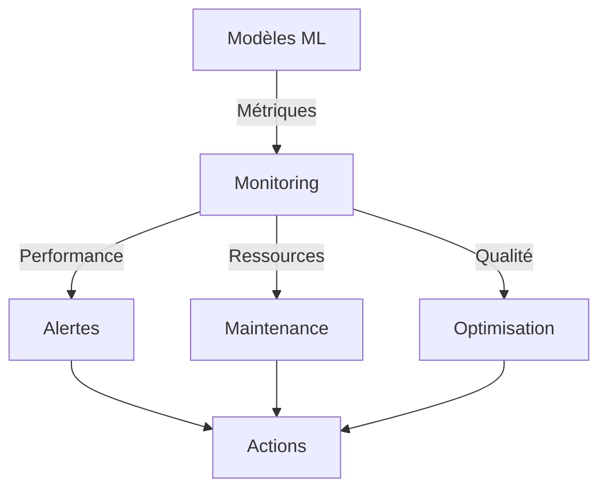

# Monitoring ML - Inventaire

## Vue d'Ensemble

### Objectifs
- Surveillance performance modèles
- Détection anomalies
- Maintenance prédictive
- Optimisation continue

### Architecture Monitoring


## Composants Monitoring

### 1. Performance
```python
class PerformanceMonitor:
    """
    Monitoring performance modèles ML
    
    Métriques:
    - Précision prédictions
    - Temps réponse
    - Utilisation ressources
    - Dérive données
    """
    
    def monitor_metrics(
        self,
        model_id: str,
        timeframe: str = '24h'
    ) -> Dict[str, float]:
        """
        Collecte métriques performance
        
        Returns:
            Dict contenant:
            - accuracy: Précision
            - latency: Temps réponse
            - memory_usage: Utilisation mémoire
            - cpu_usage: Utilisation CPU
            - data_drift: Score dérive
        """
        
    def analyze_trends(
        self,
        metrics: Dict[str, List[float]],
        window: str = '7d'
    ) -> Dict[str, Any]:
        """
        Analyse tendances métriques
        
        Returns:
            Dict analyse tendances
        """
```

### 2. Alertes
```python
class AlertManager:
    """
    Gestion alertes monitoring
    
    Types:
    - Performance dégradée
    - Ressources critiques
    - Dérive données
    - Erreurs prédiction
    """
    
    def check_thresholds(
        self,
        metrics: Dict[str, float],
        thresholds: Dict[str, float]
    ) -> List[Alert]:
        """
        Vérifie seuils alertes
        
        Returns:
            Liste alertes générées
        """
        
    def process_alert(
        self,
        alert: Alert
    ) -> Dict[str, Any]:
        """
        Traite alerte générée
        
        Returns:
            Actions recommandées
        """
```

### 3. Maintenance
```python
class MaintenanceManager:
    """
    Gestion maintenance modèles
    
    Actions:
    - Réentraînement
    - Optimisation
    - Nettoyage
    - Backup
    """
    
    def schedule_maintenance(
        self,
        model: BaseMLModel,
        metrics: Dict[str, float]
    ) -> MaintenancePlan:
        """
        Planifie maintenance
        
        Returns:
            Plan maintenance
        """
        
    def execute_maintenance(
        self,
        plan: MaintenancePlan
    ) -> Dict[str, Any]:
        """
        Exécute plan maintenance
        
        Returns:
            Résultats maintenance
        """
```

## Métriques Clés

### 1. Performance ML
```python
class MLMetrics:
    """Métriques performance ML"""
    
    def calculate_metrics(
        self,
        predictions: List[Any],
        actuals: List[Any]
    ) -> Dict[str, float]:
        """
        Calcule métriques ML
        
        Returns:
            Dict métriques:
            - accuracy: Précision
            - precision: Précision
            - recall: Rappel
            - f1_score: Score F1
        """
```

### 2. Système
```python
class SystemMetrics:
    """Métriques système"""
    
    def collect_metrics(
        self,
        service_name: str
    ) -> Dict[str, float]:
        """
        Collecte métriques système
        
        Returns:
            Dict métriques:
            - cpu_usage: Usage CPU
            - memory_usage: Usage mémoire
            - disk_usage: Usage disque
            - network_io: IO réseau
        """
```

### 3. Business
```python
class BusinessMetrics:
    """Métriques business"""
    
    def calculate_impact(
        self,
        predictions: Dict[str, Any],
        outcomes: Dict[str, Any]
    ) -> Dict[str, float]:
        """
        Calcule impact business
        
        Returns:
            Dict métriques:
            - cost_savings: Économies
            - efficiency_gain: Gain efficacité
            - quality_improvement: Amélioration qualité
        """
```

## Surveillance Dérive

### 1. Données
```python
class DataDriftMonitor:
    """Monitoring dérive données"""
    
    def detect_drift(
        self,
        reference: pd.DataFrame,
        current: pd.DataFrame
    ) -> Dict[str, float]:
        """
        Détecte dérive données
        
        Returns:
            Dict scores dérive
        """
```

### 2. Modèle
```python
class ModelDriftMonitor:
    """Monitoring dérive modèle"""
    
    def analyze_drift(
        self,
        model: BaseMLModel,
        performance_history: Dict[str, List[float]]
    ) -> Dict[str, Any]:
        """
        Analyse dérive modèle
        
        Returns:
            Dict analyse dérive
        """
```

## Configuration

### 1. Seuils
```python
THRESHOLD_CONFIG = {
    'performance': {
        'accuracy_min': 0.95,
        'latency_max': 0.2,
        'error_rate_max': 0.05
    },
    'resources': {
        'cpu_max': 80,
        'memory_max': 85,
        'disk_max': 90
    },
    'drift': {
        'data_drift_max': 0.1,
        'model_drift_max': 0.15
    }
}
```

### 2. Alertes
```python
ALERT_CONFIG = {
    'channels': {
        'email': ['team@fofal.com'],
        'slack': '#ml-monitoring'
    },
    'severity_levels': {
        'critical': 1,
        'warning': 2,
        'info': 3
    },
    'notification_rules': {
        'immediate': ['critical'],
        'daily': ['warning'],
        'weekly': ['info']
    }
}
```

### 3. Maintenance
```python
MAINTENANCE_CONFIG = {
    'schedule': {
        'retraining': '7d',
        'optimization': '30d',
        'backup': '1d'
    },
    'thresholds': {
        'performance_drop': 0.05,
        'resource_usage': 0.8,
        'data_drift': 0.1
    }
}
```

## Actions Automatiques

### 1. Performance
```python
def auto_optimize(
    model: BaseMLModel,
    metrics: Dict[str, float]
) -> Dict[str, Any]:
    """
    Optimisation automatique
    
    Returns:
        Résultats optimisation
    """
```

### 2. Ressources
```python
def auto_scale(
    service: str,
    metrics: Dict[str, float]
) -> Dict[str, Any]:
    """
    Scaling automatique ressources
    
    Returns:
        Résultats scaling
    """
```

### 3. Maintenance
```python
def auto_maintain(
    model: BaseMLModel,
    health_check: Dict[str, Any]
) -> Dict[str, Any]:
    """
    Maintenance automatique
    
    Returns:
        Résultats maintenance
    """
```

## Reporting

### 1. Dashboards
```python
class MonitoringDashboard:
    """Dashboards monitoring"""
    
    def generate_dashboard(
        self,
        metrics: Dict[str, Any],
        timeframe: str = '24h'
    ) -> Dict[str, Any]:
        """
        Génère dashboard monitoring
        
        Returns:
            Configuration dashboard
        """
```

### 2. Rapports
```python
class MonitoringReports:
    """Rapports monitoring"""
    
    def generate_report(
        self,
        data: Dict[str, Any],
        report_type: str = 'daily'
    ) -> Dict[str, Any]:
        """
        Génère rapport monitoring
        
        Returns:
            Contenu rapport
        """
```

## Tests

### 1. Monitoring
```python
def test_monitoring():
    """Test système monitoring"""
    monitor = PerformanceMonitor()
    metrics = monitor.collect_metrics()
    assert validate_metrics(metrics)
```

### 2. Alertes
```python
def test_alerts():
    """Test système alertes"""
    manager = AlertManager()
    alerts = manager.process_metrics(test_metrics)
    assert validate_alerts(alerts)
```

## Bonnes Pratiques

### 1. Monitoring
- Définir métriques clés
- Établir seuils alertes
- Automatiser collecte
- Analyser tendances

### 2. Maintenance
- Planifier maintenance régulière
- Documenter interventions
- Valider améliorations
- Maintenir historique

### 3. Documentation
- Documenter configurations
- Maintenir procédures
- Tracer changements
- Former équipe
