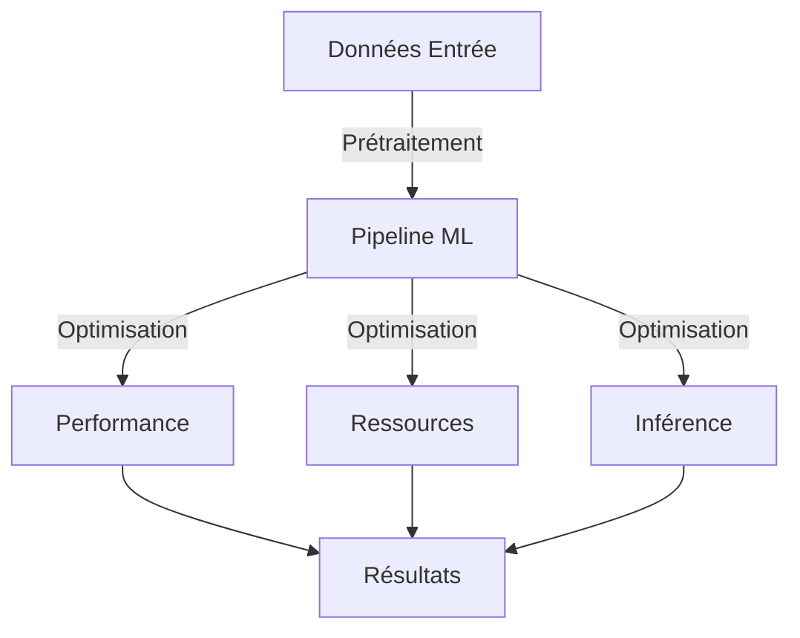

# Optimisation ML - Inventaire

## Vue d'Ensemble

### Objectifs
- Optimisation performance modèles
- Réduction utilisation ressources
- Amélioration temps réponse
- Maintien qualité prédictions

### Architecture Optimisation


## Stratégies d'Optimisation

### 1. Performance Modèles
```python
class ModelOptimizer:
    """
    Optimisation performance modèles ML
    
    Techniques:
    - Pruning modèles
    - Quantization
    - Distillation
    - Early stopping
    """
    
    def optimize_model(
        self,
        model: BaseMLModel,
        constraints: Dict[str, Any]
    ) -> Tuple[BaseMLModel, Dict[str, float]]:
        """
        Optimise modèle ML
        
        Args:
            model: Modèle à optimiser
            constraints: Contraintes ressources
            
        Returns:
            Modèle optimisé et métriques
        """
        
    def measure_performance(
        self,
        model: BaseMLModel,
        test_data: Dict[str, Any]
    ) -> Dict[str, float]:
        """
        Mesure performance modèle
        
        Returns:
            Dict métriques performance
        """
```

### 2. Ressources
```python
class ResourceOptimizer:
    """
    Optimisation utilisation ressources
    
    Aspects:
    - Mémoire
    - CPU/GPU
    - Stockage
    - Réseau
    """
    
    def optimize_memory(
        self,
        model: BaseMLModel,
        target_size: int
    ) -> BaseMLModel:
        """
        Optimise utilisation mémoire
        
        Returns:
            Modèle optimisé mémoire
        """
        
    def optimize_compute(
        self,
        model: BaseMLModel,
        target_latency: float
    ) -> BaseMLModel:
        """
        Optimise utilisation CPU/GPU
        
        Returns:
            Modèle optimisé calcul
        """
```

### 3. Inférence
```python
class InferenceOptimizer:
    """
    Optimisation inférence modèles
    
    Techniques:
    - Batch processing
    - Caching
    - Parallel inference
    - Model serving
    """
    
    def optimize_inference(
        self,
        model: BaseMLModel,
        target_latency: float
    ) -> BaseMLModel:
        """
        Optimise temps inférence
        
        Returns:
            Modèle optimisé inférence
        """
        
    def setup_caching(
        self,
        model: BaseMLModel,
        cache_config: Dict[str, Any]
    ) -> None:
        """Configure cache prédictions"""
```

## Techniques d'Optimisation

### 1. Pruning
```python
def prune_model(
    model: BaseMLModel,
    target_size: float,
    method: str = 'magnitude'
) -> BaseMLModel:
    """
    Élague modèle ML
    
    Methods:
    - magnitude: Élagage basé magnitude
    - sensitivity: Élagage basé sensibilité
    - structured: Élagage structuré
    
    Returns:
        Modèle élagué
    """
```

### 2. Quantization
```python
def quantize_model(
    model: BaseMLModel,
    precision: str = 'int8'
) -> BaseMLModel:
    """
    Quantifie modèle ML
    
    Precision:
    - int8: 8-bit integers
    - float16: 16-bit floating point
    - mixed: Précision mixte
    
    Returns:
        Modèle quantifié
    """
```

### 3. Distillation
```python
def distill_model(
    teacher: BaseMLModel,
    student_config: Dict[str, Any]
) -> BaseMLModel:
    """
    Applique distillation connaissance
    
    Returns:
        Modèle student distillé
    """
```

## Monitoring Performance

### 1. Métriques
```python
class PerformanceMonitor:
    """Monitoring performance ML"""
    
    def monitor_metrics(
        self,
        model: BaseMLModel,
        timeframe: str = '24h'
    ) -> Dict[str, float]:
        """
        Collecte métriques performance
        
        Returns:
            Dict métriques:
            - inference_latency
            - memory_usage
            - cpu_usage
            - prediction_accuracy
        """
```

### 2. Alertes
```python
class PerformanceAlerts:
    """Alertes performance ML"""
    
    def check_thresholds(
        self,
        metrics: Dict[str, float],
        thresholds: Dict[str, float]
    ) -> List[Dict[str, Any]]:
        """
        Vérifie seuils performance
        
        Returns:
            Liste alertes générées
        """
```

## Configuration

### 1. Performance
```python
PERFORMANCE_CONFIG = {
    'pruning': {
        'target_sparsity': 0.5,
        'method': 'magnitude',
        'schedule': 'polynomial'
    },
    'quantization': {
        'precision': 'int8',
        'calibration_samples': 1000
    },
    'distillation': {
        'temperature': 3.0,
        'alpha': 0.1
    }
}
```

### 2. Ressources
```python
RESOURCE_CONFIG = {
    'memory': {
        'max_usage': '2GB',
        'buffer_size': '256MB',
        'cleanup_interval': 300
    },
    'compute': {
        'max_threads': 4,
        'batch_size': 32,
        'gpu_memory': '1GB'
    }
}
```

### 3. Inférence
```python
INFERENCE_CONFIG = {
    'cache': {
        'size': '1GB',
        'ttl': 3600,
        'strategy': 'lru'
    },
    'batch': {
        'size': 64,
        'timeout': 0.1,
        'max_latency': 0.2
    }
}
```

## Validation

### 1. Tests Performance
```python
def test_optimization(
    model: BaseMLModel,
    baseline_metrics: Dict[str, float]
) -> bool:
    """
    Valide optimisations
    
    Returns:
        Succès validation
    """
```

### 2. Tests Ressources
```python
def test_resource_usage(
    model: BaseMLModel,
    limits: Dict[str, float]
) -> bool:
    """
    Valide utilisation ressources
    
    Returns:
        Respect limites
    """
```

## Maintenance

### 1. Réoptimisation
```python
def schedule_reoptimization(
    model: BaseMLModel,
    performance_threshold: float
) -> None:
    """Planifie réoptimisation modèle"""
```

### 2. Nettoyage
```python
def cleanup_resources(
    model: BaseMLModel
) -> None:
    """Nettoie ressources inutilisées"""
```

## Bonnes Pratiques

### 1. Performance
- Mesurer baseline avant optimisation
- Optimiser progressivement
- Valider impact chaque changement
- Monitorer métriques clés

### 2. Ressources
- Profiler utilisation ressources
- Identifier goulots étranglement
- Optimiser points critiques
- Maintenir marges sécurité

### 3. Maintenance
- Planifier optimisations régulières
- Documenter changements
- Maintenir versions backup
- Tester rollback
