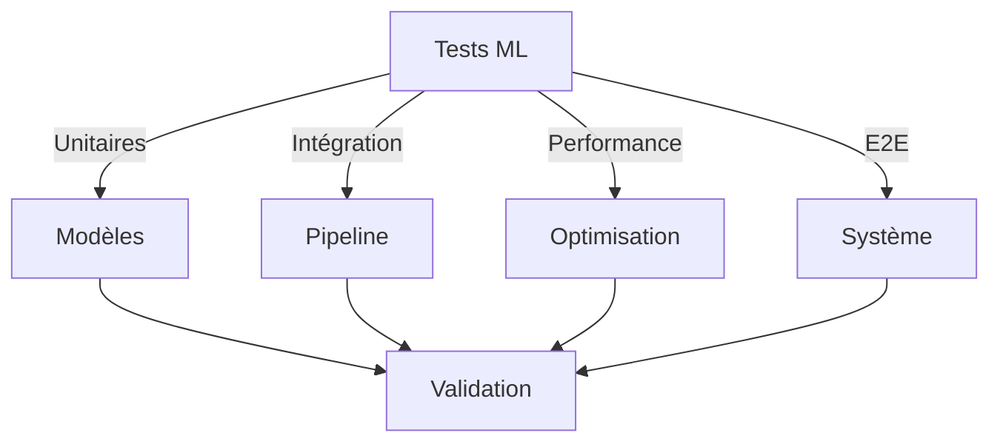

# Tests ML - Inventaire

## Vue d'Ensemble

### Objectifs
- Validation modèles ML
- Tests intégration
- Tests performance
- Tests robustesse

### Architecture Tests


## Tests Unitaires

### 1. Modèle Base
```python
class TestBaseModel:
    """Tests modèle ML base"""
    
    def test_prediction_accuracy(self):
        """Test précision prédictions"""
        model = BaseMLModel()
        predictions = model.predict(test_data)
        assert calculate_accuracy(predictions) > 0.95
        
    def test_model_training(self):
        """Test entraînement modèle"""
        model = BaseMLModel()
        metrics = model.train(training_data)
        assert metrics['loss'] < 0.1
```

### 2. Optimisation
```python
class TestOptimizer:
    """Tests optimisation stocks"""
    
    def test_stock_optimization(self):
        """Test optimisation niveaux stocks"""
        optimizer = StockOptimizer()
        result = optimizer.optimize(test_scenario)
        assert result['efficiency_gain'] > 0.15
        
    def test_constraints_respect(self):
        """Test respect contraintes"""
        optimizer = StockOptimizer()
        result = optimizer.optimize(test_scenario)
        assert validate_constraints(result)
```

### 3. Analyse
```python
class TestAnalyzer:
    """Tests analyse patterns"""
    
    def test_pattern_detection(self):
        """Test détection patterns"""
        analyzer = PatternAnalyzer()
        patterns = analyzer.analyze(test_data)
        assert len(patterns) > 0
        
    def test_anomaly_detection(self):
        """Test détection anomalies"""
        analyzer = PatternAnalyzer()
        anomalies = analyzer.detect_anomalies(test_data)
        assert validate_anomalies(anomalies)
```

## Tests Intégration

### 1. Pipeline ML
```python
class TestMLPipeline:
    """Tests pipeline ML complet"""
    
    def test_full_pipeline(self):
        """Test pipeline bout en bout"""
        pipeline = MLPipeline()
        result = pipeline.process(test_data)
        assert validate_pipeline_result(result)
        
    def test_component_integration(self):
        """Test intégration composants"""
        pipeline = MLPipeline()
        assert validate_component_integration(pipeline)
```

### 2. Intégrations Externes
```python
class TestExternalIntegrations:
    """Tests intégrations externes"""
    
    def test_weather_integration(self):
        """Test intégration météo"""
        integration = WeatherIntegration()
        result = integration.process_forecast(test_forecast)
        assert validate_weather_integration(result)
        
    def test_iot_integration(self):
        """Test intégration IoT"""
        integration = IoTIntegration()
        result = integration.process_sensor_data(test_data)
        assert validate_iot_integration(result)
```

## Tests Performance

### 1. Latence
```python
class TestLatency:
    """Tests latence système"""
    
    def test_prediction_latency(self):
        """Test latence prédictions"""
        model = BaseMLModel()
        start = time.time()
        model.predict(test_data)
        latency = time.time() - start
        assert latency < 0.2  # 200ms max
        
    def test_optimization_latency(self):
        """Test latence optimisation"""
        optimizer = StockOptimizer()
        start = time.time()
        optimizer.optimize(test_scenario)
        latency = time.time() - start
        assert latency < 1.0  # 1s max
```

### 2. Ressources
```python
class TestResources:
    """Tests utilisation ressources"""
    
    def test_memory_usage(self):
        """Test utilisation mémoire"""
        monitor = ResourceMonitor()
        usage = monitor.measure_memory(test_function)
        assert usage < 512  # 512MB max
        
    def test_cpu_usage(self):
        """Test utilisation CPU"""
        monitor = ResourceMonitor()
        usage = monitor.measure_cpu(test_function)
        assert usage < 80  # 80% max
```

## Tests E2E

### 1. Scénarios Métier
```python
class TestBusinessScenarios:
    """Tests scénarios métier"""
    
    def test_stock_management(self):
        """Test gestion stocks complète"""
        scenario = StockManagementScenario()
        result = scenario.run()
        assert validate_scenario_result(result)
        
    def test_quality_control(self):
        """Test contrôle qualité"""
        scenario = QualityControlScenario()
        result = scenario.run()
        assert validate_quality_result(result)
```

### 2. Workflows
```python
class TestWorkflows:
    """Tests workflows complets"""
    
    def test_optimization_workflow(self):
        """Test workflow optimisation"""
        workflow = OptimizationWorkflow()
        result = workflow.execute()
        assert validate_workflow_result(result)
        
    def test_monitoring_workflow(self):
        """Test workflow monitoring"""
        workflow = MonitoringWorkflow()
        result = workflow.execute()
        assert validate_monitoring_result(result)
```

## Tests Robustesse

### 1. Données
```python
class TestDataRobustness:
    """Tests robustesse données"""
    
    def test_missing_data(self):
        """Test données manquantes"""
        model = BaseMLModel()
        result = model.predict(incomplete_data)
        assert validate_prediction(result)
        
    def test_invalid_data(self):
        """Test données invalides"""
        model = BaseMLModel()
        with pytest.raises(ValidationError):
            model.predict(invalid_data)
```

### 2. Système
```python
class TestSystemRobustness:
    """Tests robustesse système"""
    
    def test_error_handling(self):
        """Test gestion erreurs"""
        service = MLService()
        result = service.handle_error(test_error)
        assert validate_error_handling(result)
        
    def test_recovery(self):
        """Test récupération erreurs"""
        service = MLService()
        result = service.recover_from_error(test_error)
        assert validate_recovery(result)
```

## Configuration Tests

### 1. Environnement
```python
TEST_ENV_CONFIG = {
    'data': {
        'test_size': 0.2,
        'random_state': 42
    },
    'performance': {
        'latency_threshold': 0.2,
        'memory_threshold': 512,
        'cpu_threshold': 80
    }
}
```

### 2. Données Test
```python
TEST_DATA_CONFIG = {
    'scenarios': {
        'normal': 'data/test/normal.csv',
        'edge_cases': 'data/test/edge_cases.csv',
        'stress': 'data/test/stress.csv'
    },
    'validation': {
        'metrics': ['accuracy', 'precision', 'recall'],
        'thresholds': {
            'accuracy': 0.95,
            'precision': 0.9,
            'recall': 0.9
        }
    }
}
```

## Validation

### 1. Métriques
```python
def validate_metrics(
    metrics: Dict[str, float],
    thresholds: Dict[str, float]
) -> bool:
    """
    Valide métriques tests
    
    Returns:
        Validation réussie
    """
```

### 2. Résultats
```python
def validate_test_results(
    results: Dict[str, Any],
    requirements: Dict[str, Any]
) -> bool:
    """
    Valide résultats tests
    
    Returns:
        Validation réussie
    """
```

## Bonnes Pratiques

### 1. Tests
- Isolation tests
- Reproductibilité
- Couverture complète
- Documentation claire

### 2. Données
- Jeux test variés
- Validation croisée
- Cas limites
- Données réalistes

### 3. Maintenance
- Tests réguliers
- Mise à jour données
- Revue résultats
- Amélioration continue
