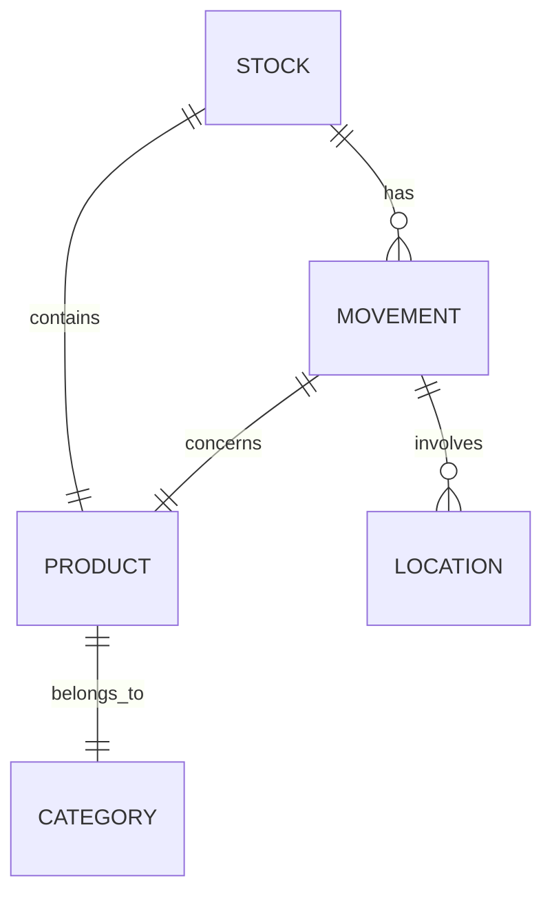

# Modèles de données du Module Inventaire

## Vue d'ensemble

Les modèles de données du module inventaire sont conçus pour gérer efficacement les stocks, mouvements et prédictions.

## Modèles principaux

### Stock

```python
class Stock(BaseModel):
    """Modèle de stock"""
    
    id: int
    product_id: int
    location_id: int
    quantity: float
    min_quantity: float
    max_quantity: float
    unit: UniteMesure
    last_updated: datetime
    
    class Config:
        orm_mode = True
```

### Mouvement

```python
class StockMovement(BaseModel):
    """Modèle de mouvement de stock"""
    
    id: int
    product_id: int
    quantity: float
    type: MovementType
    reference_document: Optional[str]
    location_from: Optional[int]
    location_to: Optional[int]
    timestamp: datetime
    user_id: int
    
    class Config:
        orm_mode = True
```

### Produit

```python
class Product(BaseModel):
    """Modèle de produit"""
    
    id: int
    code: str
    name: str
    description: Optional[str]
    category: CategoryProduit
    unit: UniteMesure
    barcode: Optional[str]
    image_url: Optional[str]
    active: bool = True
    
    class Config:
        orm_mode = True
```

## Types et Énumérations

### Types de mouvement

```python
class MovementType(str, Enum):
    """Types de mouvements de stock"""
    
    IN = "IN"          # Entrée
    OUT = "OUT"        # Sortie
    TRANSFER = "TRANSFER"  # Transfert
    ADJUST = "ADJUST"  # Ajustement
```

### Catégories

```python
class CategoryProduit(str, Enum):
    """Catégories de produits"""
    
    MATIERE_PREMIERE = "MATIERE_PREMIERE"
    PRODUIT_FINI = "PRODUIT_FINI"
    CONSOMMABLE = "CONSOMMABLE"
    OUTILLAGE = "OUTILLAGE"
```

### Unités

```python
class UniteMesure(str, Enum):
    """Unités de mesure"""
    
    UNITE = "UNITE"
    KG = "KG"
    LITRE = "LITRE"
    METRE = "METRE"
    METRE_CARRE = "METRE_CARRE"
```

## Modèles ML

### Prédiction

```python
class StockPrediction(BaseModel):
    """Modèle de prédiction de stock"""
    
    product_id: int
    predicted_quantity: float
    confidence: float
    horizon: int
    features: Dict[str, float]
    timestamp: datetime
    
    class Config:
        orm_mode = True
```

### Optimisation

```python
class StockOptimization(BaseModel):
    """Modèle d'optimisation de stock"""
    
    product_id: int
    current_quantity: float
    optimal_quantity: float
    reorder_point: float
    safety_stock: float
    economic_order_quantity: float
    
    class Config:
        orm_mode = True
```

## Relations

### Associations



### Contraintes

- Unicité product_id + location_id dans Stock
- Quantité >= 0 dans Stock
- Type valide dans Movement
- Référence document unique
- Code produit unique

## Validation

### Règles métier

```python
class StockValidator:
    """Validateur de stock"""
    
    @staticmethod
    def validate_quantity(quantity: float) -> bool:
        """Valide une quantité"""
        return quantity >= 0
        
    @staticmethod
    def validate_movement(
        movement: StockMovement,
        current_stock: Stock
    ) -> bool:
        """Valide un mouvement"""
        if movement.type == MovementType.OUT:
            return current_stock.quantity >= movement.quantity
        return True
```

## Migration

### Exemple

```python
"""Migration stock

Revision ID: abc123
"""

def upgrade():
    op.create_table(
        'stock',
        sa.Column('id', sa.Integer(), nullable=False),
        sa.Column('product_id', sa.Integer(), nullable=False),
        sa.Column('quantity', sa.Float(), nullable=False),
        sa.Column('location_id', sa.Integer(), nullable=False),
        sa.PrimaryKeyConstraint('id'),
        sa.UniqueConstraint('product_id', 'location_id')
    )
```

## Points d'attention

### Performance
- Index optimisés
- Requêtes efficientes
- Cache intelligent
- Transactions optimisées

### Intégrité
- Contraintes respectées
- Validation données
- Cohérence relations
- Audit trail

### Évolution
- Migrations simples
- Rétrocompatibilité
- Documentation claire
- Tests migration
